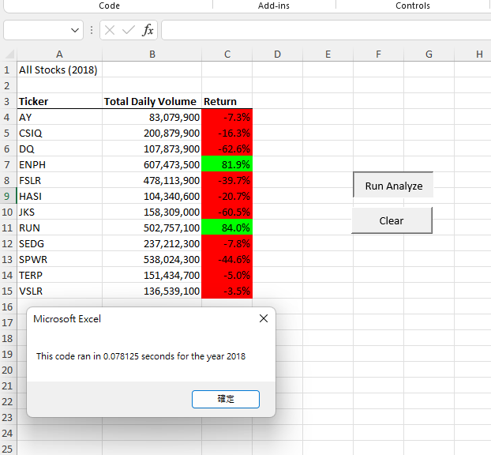
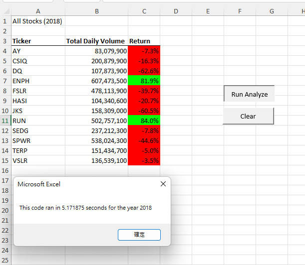
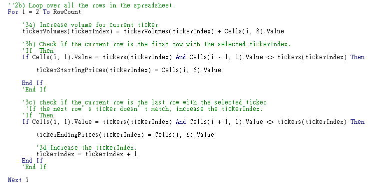
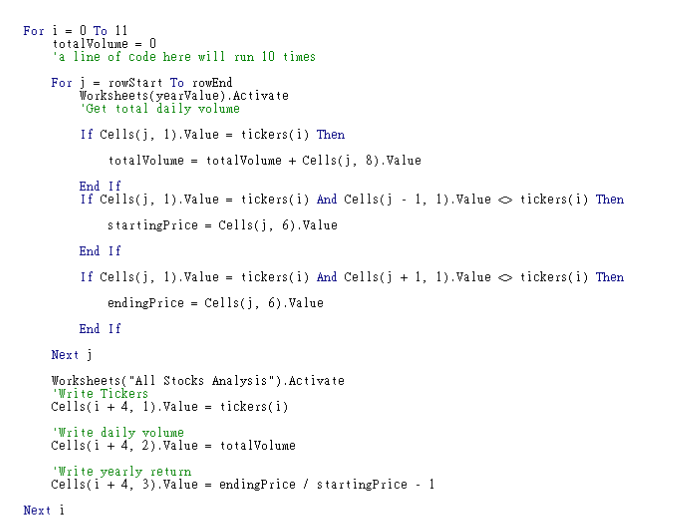
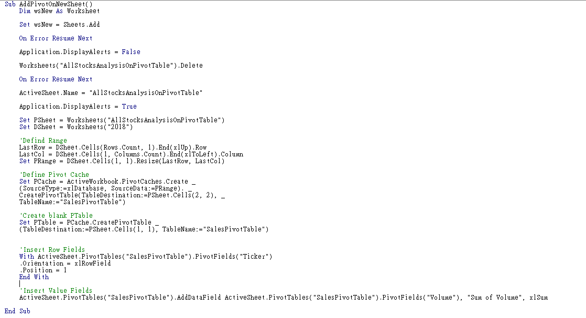
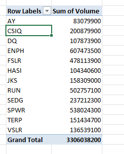

# stock-analysis
## Overview of Project
This project is to help Steve to analyze the green energy stocks for his parents investment.
## Results
The difference between two of the analysis is that the refactored one spend less time to calculate daily volume and yearly return. 

 
(Refactored script)

 
(Original script)

Because the refactored script doesn't use the nested for loop, so it load all 3012 rows of trading data for calculating every tickers' daily volume only once for all.

 

On the other hand, the original script use nested for loop whitch make VBA load data every time when ticker change.

 

That is the main reason, the refactored script spend much more less time then the other one.

## Summary
### What are the advantages or disadvantages of refactoring code?
The advantage of refactoring code is that it proccess way more fast than the original code, and because it store data in array variable which make the code easy to understand. 

The disadvantage of refactoring code is that the variable tickers are writen by programmer, if users want to analysis more than 50 or 100 stocks it will need to spend too much time for adding tickers, if we use VBA to create a pivot table for Steve to analyze it might be more organized and could handle more data.
 
 

### How do these pros and cons apply to refactoring the original VBA script?
The refactoring script use if statements to distinguish the ticker and increase the process speed, but if the tickers in the Excel didn't show in orders, we still need nested for loop to check every row to find all tickers.

Also both of scripts' tickers array were writen by programmer, if there are more than 20 thickers then it will spend too much time for building array variable. 